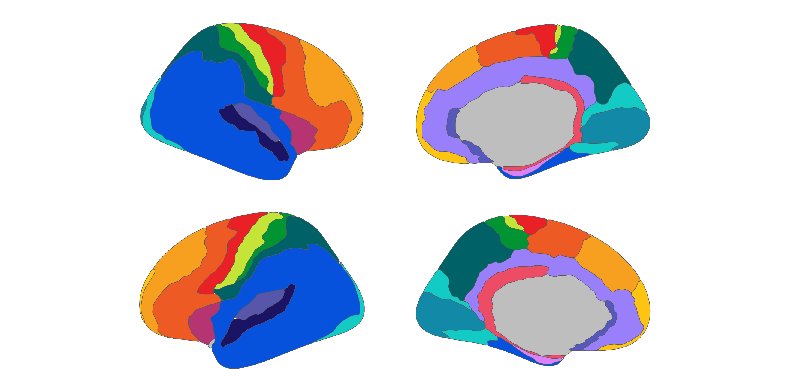

# ggsegCampbell

This package contains the Campbell (1905) cortical atlas for the ggseg
ecosystem, based on the supplementary materials of Pijnenburg et al.,
*NeuroImage*, 239, 2021
([DOI](https://doi.org/10.1016/j.neuroimage.2021.118274)).

Campbell A.W. (1905). Histological Studies On the Localisation of
Cerebral Function. Cambridge University Press.

To learn how to use these atlases, please look at the documentation for
[ggseg](https://ggseg.github.io/ggseg/) and
[ggseg3d](https://ggseg.github.io/ggseg3d).

## Installation

We recommend installing the ggseg-atlases through the ggseg
[r-universe](https://ggseg.r-universe.dev/ui#builds):

``` r
options(repos = c(
    ggseg = 'https://ggseg.r-universe.dev',
    CRAN = 'https://cloud.r-project.org'))

install.packages('ggsegCampbell')
```

You can install the development version of ggsegCampbell from
[GitHub](https://github.com/) with:

``` r
# install.packages("remotes")
remotes::install_github("ggseg/ggsegCampbell")
```

## Example

``` r
library(ggsegCampbell)
library(ggseg)
library(ggplot2)

ggplot() +
  geom_brain(
    atlas = campbell(),
    mapping = aes(fill = label),
    position = position_brain(hemi ~ view),
    show.legend = FALSE
  ) +
  scale_fill_manual(values = campbell()$palette, na.value = "grey") +
  theme_void()
```



``` r
library(ggseg3d)

ggseg3d(atlas = campbell()) |>
  pan_camera("right lateral")
```


Please note that the ‘ggsegCampbell’ project is released with a
[Contributor Code of
Conduct](https://ggseg.github.io/ggsegCampbell/CODE_OF_CONDUCT.md). By
contributing to this project, you agree to abide by its terms.
